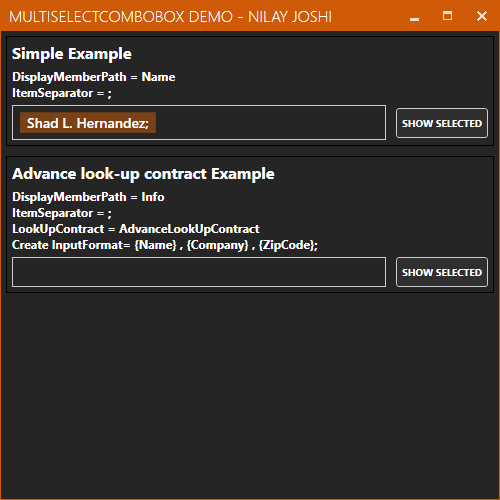
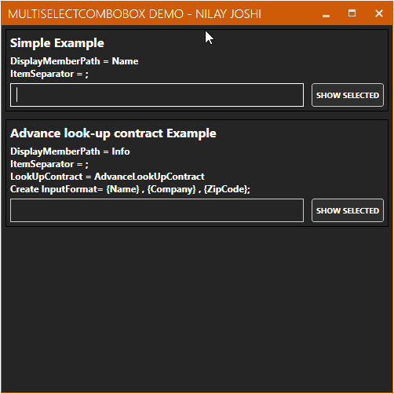

# BlackPearl WPF Control Library

***

# About repository
This repository is created to put different basic WPF Custom-control/User-controls under same roof. These controls solve basic and frequently faced issue by developers. As of now, this contains only one custom-control **MultiSelectCombobox**. In future, I'm planning to add more.

[BlackPearl](https://github.com/nilayjoshi89/BlackPearl) is licensed under [MIT license](https://github.com/nilayjoshi89/BlackPearl/blob/master/LICENSE).
***

### Content:
* [MultiSelectCombobox (v2.0.0)](#multiselectcombobox)
  * [Overview](#overview)
  * [Feature](#feature)
  * [Design Document](Docs/MultiSelectCombobox_Design_Doc_v1.md)
* [Explaining Demo Code](Docs/Demo_App_Code_v1.md)
* [Version History](Docs/Version_History.md)

***

# MultiSelectCombobox

## Overview
WPF has ListBox control which lets user select more than one item. However, ListBox control UI doesn't have in-built support for searching/filtering. Developers have to do work around to provision one. Moreover, lot of mouse interaction is required. Yes, you may be able to do all completely using keyboard. But, not most efficient way of doing. On the other hand, Combobox has a very good UI which supports searching and filtering. However, it doesn't support multiple selection.

What if we can combine behavior of ListBox and goodness of Combobox UI? MultiSelectCombobox exactly does the same thing. It provides functionality of searching/filtering with multiple selection. MultiSelectCombobox tries to mimic UI behavior of ComboBox.

***
## Feature
* In built support for searching and filtering
* Extensible to support custom searching and filtering for Complex data type
* Ability to create and add new item which is not part of source collection (through LookUpContract for complex types)
* Easy to use!
